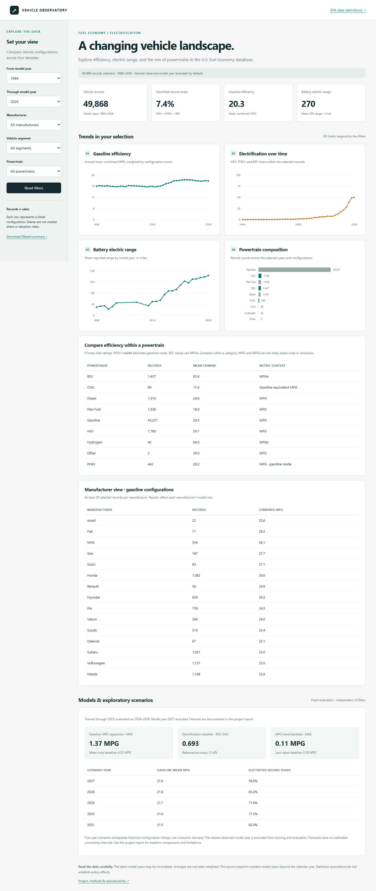
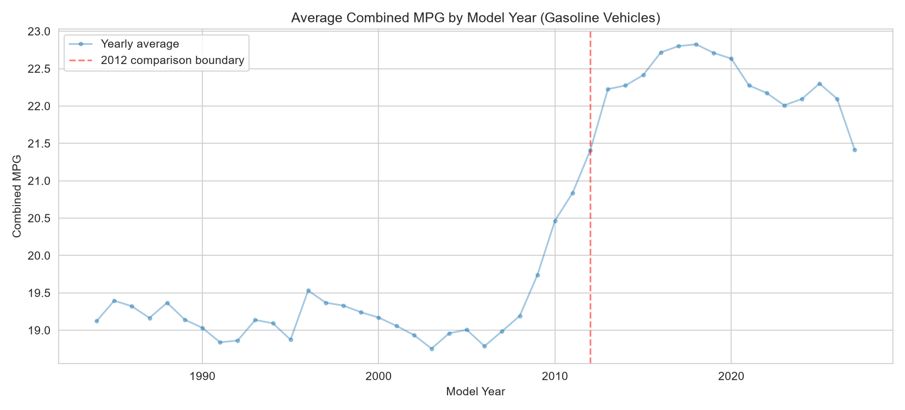
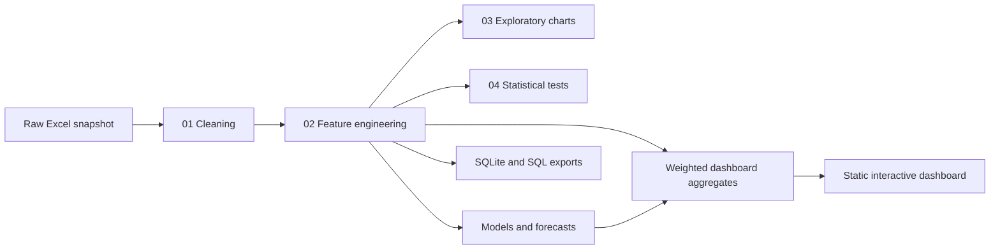
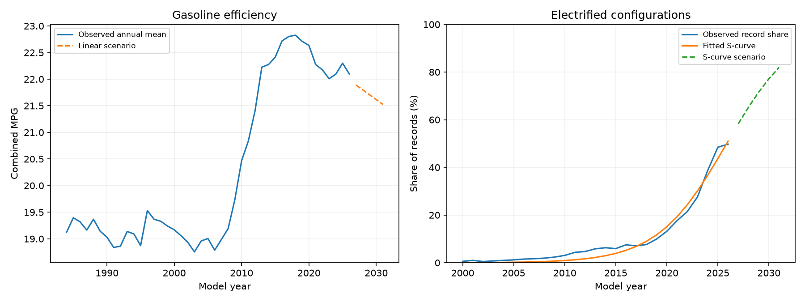

# Vehicle MPG & Electrification Analysis

A reproducible analysis of **50,242 vehicle configurations across model years 1984–2027**, connecting fuel economy, vehicle design, and electrification in the U.S. fuel economy database.

The project includes executed notebooks, exploratory charts, statistical tests, predictive models, SQL analyses, and a responsive interactive dashboard. It studies **listed vehicle configurations**, not sales, registrations, or the on-road fleet.

## Explore the project

- [Project report: findings, methods, and limitations](reports/project_report.md)
- [Live interactive dashboard](https://mpg-electrification-analysis.vercel.app) | [Local setup and deployment](dashboard/README.md)
- [Skills and knowledge applied](reports/skills_and_knowledge.md)
- [Data provenance and dictionary](data/README.md)
- [Implementation and verification record](reports/verification.md)





## Main findings

| Finding | Result in this snapshot |
| --- | --- |
| Mean gasoline combined MPG | 19.12 in 1984; 22.10 in 2026 |
| Mean BEV range | 105.6 miles in 2012 (8 records); 302.1 miles in 2026 (321 records) |
| Electrified configurations in model year 2026 | 49.74% HEV, PHEV, or BEV |
| Gasoline engine displacement vs. combined MPG | Pearson correlation −0.778 |
| Gasoline MPG model, held-out 2024–2026 | MAE 1.37 MPG; R² 0.860 |

These averages give every configuration equal weight. The 2027 records are preserved, but the dashboard defaults through 2026 and the models exclude 2027 because the newest observed year may be incomplete. Earlier years can also be incomplete or subsequently revised.

## Features

| Area | Implemented work |
| --- | --- |
| Cleaning | Select 35 analysis columns; inspect missingness, identifiers and numeric contamination; repair date-parsed model names; export Parquet |
| Feature engineering | Powertrain classification, transmission parsing, gear counts, seven vehicle segments, time-period flags, and laboratory-versus-adjusted rating gaps |
| Efficiency analysis | Annual and segment MPG trends; manufacturer and model rankings; segment comparisons; cylinder/drivetrain heatmaps; separate BEV efficiency rankings |
| Electrification analysis | Annual powertrain mix, first recorded appearances, manufacturer timeline, BEV range, primary-fuel efficiency comparison, segment shares, and PHEV electricity-mode range |
| Statistics | One-way ANOVA, Kruskal–Wallis, Welch's t-test, Cohen's d, Pearson correlation, and chi-square with expected-cell diagnostics |
| Modeling | Random-forest MPG regression; logistic electrification classification; annual MPG trend forecast; bounded logistic S-curve scenario |
| SQL | SQLite database, aggregations, CTEs, joins, rankings, year-over-year changes, and rolling means |
| Dashboard | Year, make, segment, and powertrain filters; four responsive SVG charts; KPIs; comparison tables; model evaluation; CSV download; empty-state handling |
| Reproducibility | Pinned direct dependencies, one-command rebuild, analytical regression checks, browser checks, and GitHub Actions workflow |

## Quick start

Use **Python 3.14**. The project was verified locally with Python 3.14.2 on Windows and rebuilt successfully on Linux in GitHub Actions. Direct package versions are recorded in [requirements.txt](requirements.txt); transitive dependencies are not fully locked.

```powershell
# Windows PowerShell (activation is optional)
py -3.14 -m venv .venv
.\.venv\Scripts\python.exe -m pip install -r requirements.txt
.\.venv\Scripts\python.exe scripts/run_all.py
.\.venv\Scripts\python.exe -m unittest discover -s tests -v
```

```bash
# macOS / Linux
python3.14 -m venv .venv
.venv/bin/python -m pip install -r requirements.txt
.venv/bin/python scripts/run_all.py
.venv/bin/python -m unittest discover -s tests -v
```

Run commands from the repository root. The source workbook and current generated outputs are included, so there is no download or API key requirement. The rebuild executes the four notebooks sequentially, regenerates outputs, trains the models, executes SQL, and exports the dashboard data. It overwrites generated analysis files, but leaves the raw workbook unchanged.

To explore notebooks interactively:

```bash
python -m jupyterlab
```

Select the environment containing the installed requirements, open `notebooks/`, and run notebooks in numerical order. Notebook-relative paths assume the kernel working directory is `notebooks/`; the pipeline runner sets that directory automatically.

## Run the dashboard

The dashboard is plain HTML, CSS, and JavaScript with local data and no external runtime libraries. You can use it without installing the scientific Python dependencies if the committed `dashboard/data.json` is present.

```bash
python -m http.server 8501 --bind 127.0.0.1 --directory dashboard
```

Open **http://127.0.0.1:8501**. Serve it over HTTP; opening `index.html` directly can prevent the browser from loading JSON.

The filters update weighted summaries of 7,109 pre-aggregated groups. Downloaded CSVs contain those selected groups, counts, and additive sums, rather than individual vehicle rows. Model evaluation and forecasts use a fixed dataset and do not change with dashboard filters.

For hosting instructions and current deployment status, see [dashboard/README.md](dashboard/README.md).

## Pipeline and repository layout

```text
mpg-electrification-analysis/
├── data/
│   ├── raw/vehicles.xlsx              # Original snapshot, unchanged
│   ├── processed/                     # Clean/features Parquet and readable Excel
│   └── README.md                      # Provenance and column dictionary
├── notebooks/
│   ├── 01_data_cleaning.ipynb
│   ├── 02_feature_engineering.ipynb
│   ├── 03_trends_and_efficiency.ipynb
│   └── 04_statistical_analysis.ipynb
├── scripts/
│   ├── run_all.py                     # Full reproduction entry point
│   ├── run_notebooks.py
│   ├── modeling.py
│   ├── run_sql.py
│   └── build_dashboard.py
├── sql/                               # Five standalone SQL analyses
├── dashboard/                         # Static app and generated JSON
├── reports/
│   ├── charts/                        # Gasoline efficiency figures
│   ├── modeling/                      # Metrics, predictions, scenarios, figures
│   ├── sql/                           # Query result CSVs
│   └── *.md                           # Methods, findings, skills, verification
├── tests/                             # Analytical and browser regression checks
├── .github/workflows/analysis.yml     # Rebuild and test on GitHub
├── requirements.txt
└── steps.md                           # Roadmap and completion status
```



Run individual stages with `python scripts/modeling.py`, `python scripts/run_sql.py`, or `python scripts/build_dashboard.py`. The dashboard build requires model outputs. The SQLite database is generated locally and excluded from Git because it duplicates the Parquet data.

## Model evaluation

Training uses model years through **2023**. The held-out period is **2024–2026**. The newest observed year, **2027**, is excluded. Preprocessing is fitted only on training data. Final forecast scenarios refit on data through 2026 after backtesting.

| Task | Model | Held-out result | Baseline / qualification |
| --- | --- | --- | --- |
| Gasoline combined MPG | Random forest | MAE 1.374; RMSE 1.901; R² 0.860 | Training-mean baseline MAE 4.246 |
| Electrified configuration | Class-weighted logistic regression | ROC AUC 0.693; balanced accuracy 0.514 | Accuracy 0.473 is below majority baseline 0.545; default threshold is weak |
| Annual gasoline MPG | Trailing ten-year linear trend | MAE 0.107 MPG | Last-value baseline MAE 0.155 MPG |
| Electrified record share | Bounded logistic S-curve | MAE 11.90 percentage points | Last-value baseline 18.04 points; fitted ceiling reaches the imposed upper bound |

The classifier excludes direct target proxies such as fuel type, powertrain, engine size, range, and efficiency. It is a baseline for studying associations, not a reliable classifier of future individual vehicles. The forecast horizon is **2027–2031**. Treat these outputs as extrapolation scenarios: no calibrated prediction intervals or sales-demand forecasts are provided.



Full numerical results are in [metrics.json](reports/modeling/metrics.json), [holdout predictions](reports/modeling/mpg_predictions.csv), and [forecast backtest](reports/modeling/forecast_backtest.csv).

## Important interpretation rules

- `comb08` follows the primary fuel. Gasoline vehicles use MPG; BEVs use MPGe. For PHEVs, the primary-fuel metric is gasoline-mode MPG, not the composite gasoline/electric metric.
- PHEV electricity-mode range uses `rangeA` when `fuelType2` is Electricity. The original primary `range` values averaged about 434 miles and were incorrectly described as electric range before review.
- `UCity` and `UHighway` are unadjusted laboratory ratings. Their difference from adjusted ratings is not an owner-reported performance gap.
- A 2012 pre/post comparison is descriptive. It does not estimate a causal policy effect.
- Repeated models/configurations, changing product mix, sparse categories, and multiple tests constrain statistical interpretation. Fifteen of 63 expected cells in the chi-square table are below five.
- The source preserves manufacturer spellings such as `MINI` and `Mini`; model-name cleanup is heuristic. Rankings are sensitive to grouping and sample size.

Field meanings were checked against the [FuelEconomy.gov data dictionary](https://www.fueleconomy.gov/feg/ws/index.shtml). See the [project report](reports/project_report.md) for the full limitations and review corrections.

## Skills and technologies

**Python, pandas, NumPy, Jupyter, SciPy, scikit-learn, Matplotlib, Seaborn, SQLite, SQL window functions, HTML, CSS, JavaScript, SVG, Git, and GitHub Actions.**

The work demonstrates missing-data analysis, feature engineering, exploratory visualization, statistical inference, leakage-aware temporal evaluation, baseline comparison, forecasting, browser-side aggregation, automated validation, and technical communication. [Skills and knowledge applied](reports/skills_and_knowledge.md) maps each capability to concrete project files and distinguishes existing work from the completion pass.

## Data and reuse

The workbook was already present when this project was reviewed. Its field names match the FuelEconomy.gov vehicle table; the exact original download date and any prior conversion history were not recorded. The raw snapshot is fingerprinted and preserved. The official [download page](https://www.fueleconomy.gov/feg/download.shtml) provides current data, which may differ from this snapshot.

No code license has been selected. Source data remain subject to their original terms and attribution requirements; inclusion here is not a new license grant.
